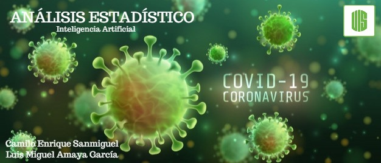

# ANÁLISIS ESTADÍSTICO SOBRE COVID-19

## Autores
#### Camilo Enrique Sanmiguel Arenas
#### Luis Miguel Amaya Garcia

## Introduccion

En estos últimos meses no ha salido tema más importante que hablar que del coronavirus, una pandemia que se ha venido registrando cada vez con más fuerza alrededor del mundo, la cual va dejando actualmente cientos de muertos diarios, miles de contagiados y nuevos sectores infectados. Los datos que deja la propagación se han venido actualizando con el tiempo, sin embargo tenemos poca claridad en lo que consiste a cada caso, cada persona que se encuentra infectada; por otra parte, la mayoría de datos generados son estadísticos, una sumatoria total de cada factor analizado, muertes, contagiados y recuperados; esto con el fin de tomar en cuenta que la información a analizar viene con completo detalle para hacer un análisis estadístico independiente a los realizados por distintos analistas de datos alrededor del mundo

## Objetivos
- Predecir el estado vital de pacientes con determinada edad.
- Trazar y analizar comportamientos estadísticos proporcionados por los datos
- Implementar el uso de diversos mecanismos vistos en el curso para análisis, predicción y comprobación de acertación en el tratamiento de datos

## Recursos

- **Dataset :** Mas de 4 mil pacientes infectado por covid alrededor del mundo
- **Modelos :** SVC (Support Vector Classifier), KNeighborsClassifier,GaussianNB,DecisionTreeClassifier,RandomForestClassifier

## Links

* **Link del Video** - [Ver](#)
* **Link del Dataset1**  - [Ver](https://www.kaggle.com/sudalairajkumar/novel-corona-virus-2019-dataset)
* **Link del Dataset2**  - [Ver](https://docs.google.com/spreadsheets/d/e/2PACX-1vQU0SIALScXx8VXDX7yKNKWWPKE1YjFlWc6VTEVSN45CklWWf-uWmprQIyLtoPDA18tX9cFDr-aQ9S6/pubhtml#)
